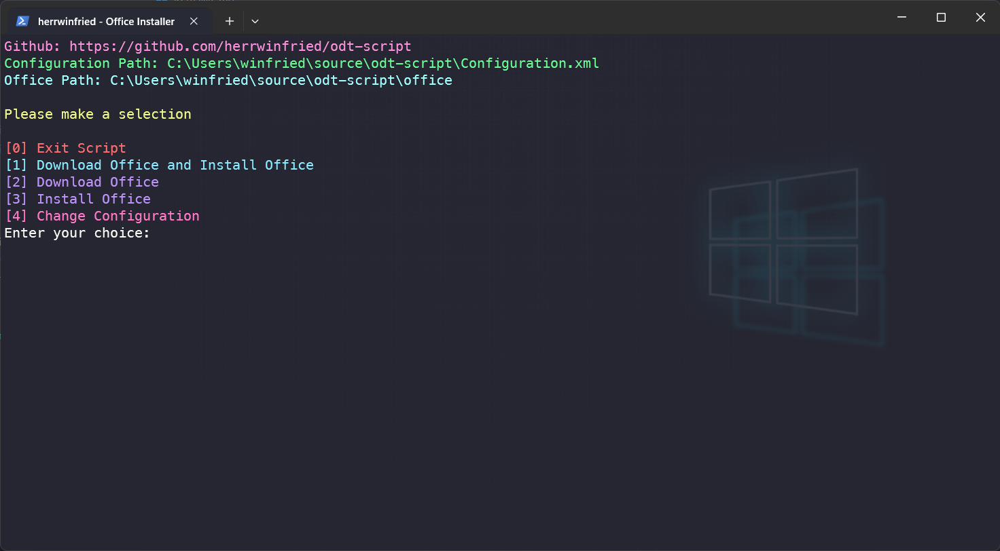

<div align="center">


<p> <b>Powershell script designed to make the office deployment tool tool easier to use </b></p>
</div>



# Usage
Double-click the `installer.bat` file.
### OR
```pwsh
start powershell.exe -ExecutionPolicy Bypass -File .\installer.ps1
```